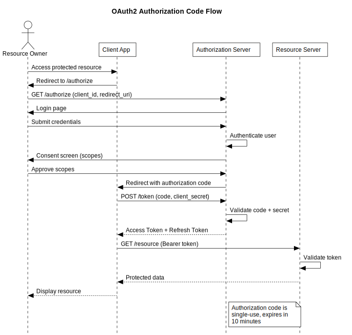
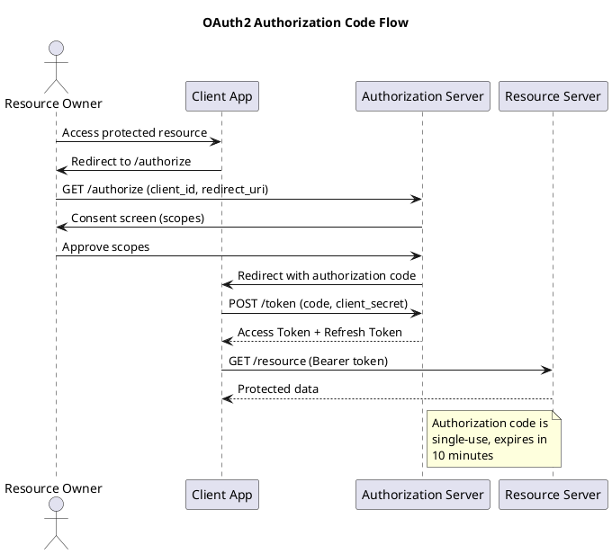
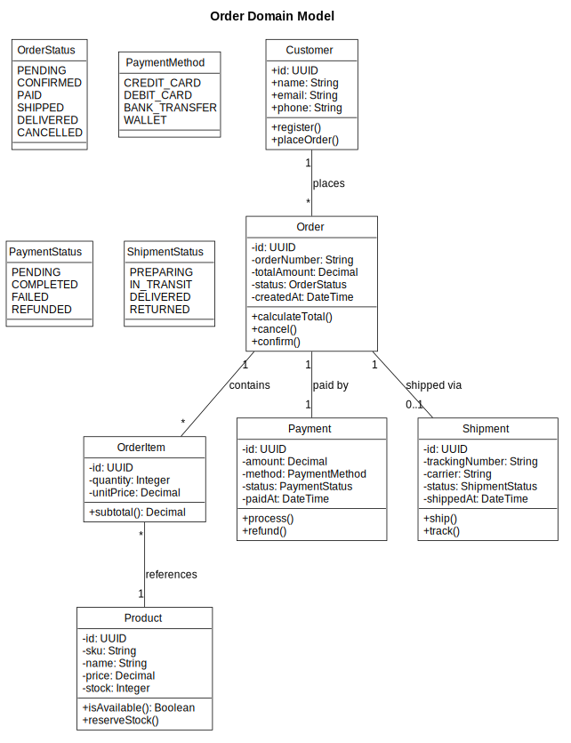
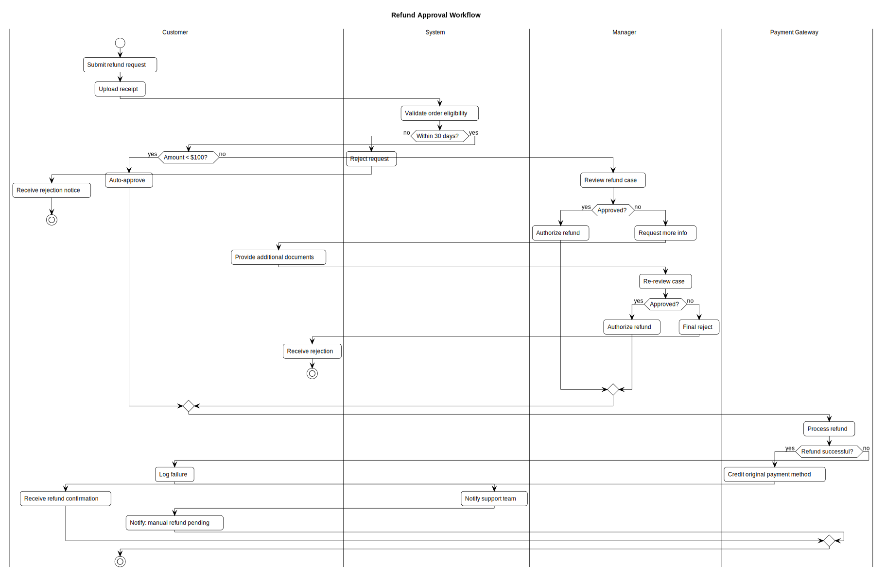
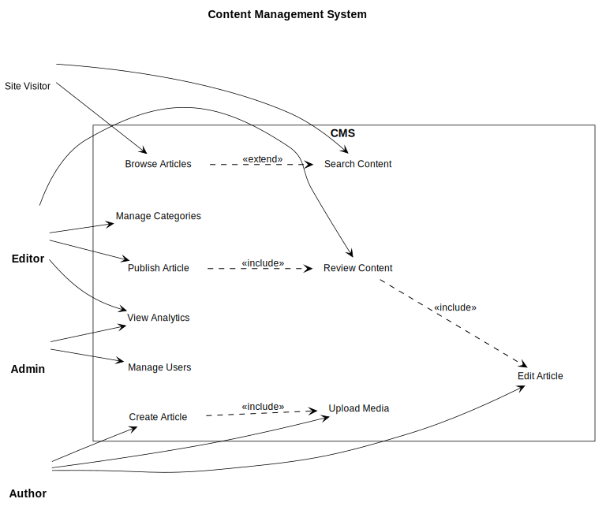
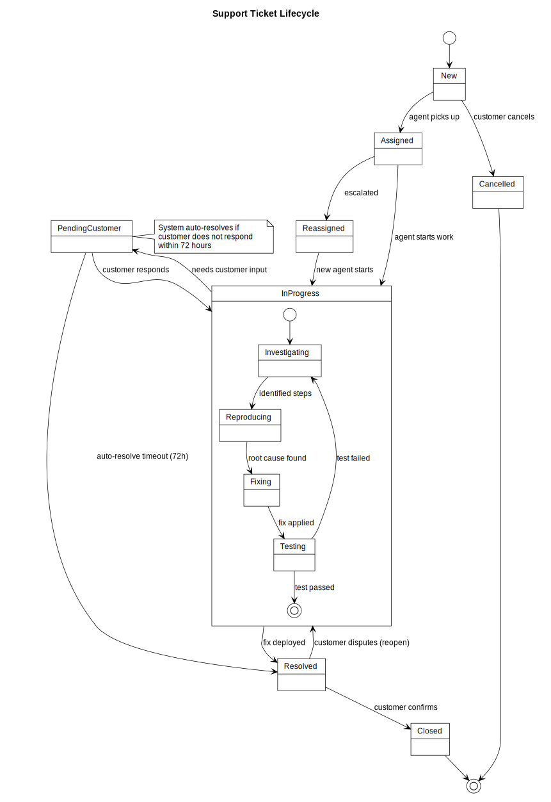

# PlantUML Skill for OpenCode

**English** · [简体中文](README.zh-CN.md)

Natural language → PlantUML diagrams → SVG/PNG/PDF. An [OpenCode](https://github.com/voidzero-dev/opencode) skill that generates [uml-diagrams.org](https://www.uml-diagrams.org)-style (strict OMG UML 2.x, monochrome) diagrams from plain English descriptions.

[](https://skills.sh/samonysh/plantuml-skill)
[](https://clawhub.ai/samonysh/plantuml-skill)
[](https://clawhub.ai/samonysh/plantuml-skill)
[](https://clawhub.ai/samonysh/plantuml-skill)
[](LICENSE)

## Features

- **9 diagram types**: Sequence, Class, Activity, Use Case, Component, State, Deployment, Gantt, Mind Map
- **Natural language input**: Describe what you want — the skill picks the right diagram type
- **uml-diagrams.org reference style**: Pure black-and-white, dashed lifelines, white activation bars, text stereotypes — matches every figure on https://www.uml-diagrams.org
- **Two equivalent preambles**: classic `skinparam` (max backward compatibility) and modern CSS `<style>` block (recommended on PlantUML ≥ 1.2019.9)
- **Cross-platform render scripts**: Bash (Linux/macOS/Git-Bash/WSL) and PowerShell (Windows native)
- **Local-first rendering**: Docker → local JAR → public server (last is **opt-in only**, see [Privacy](#privacy))
- **Text-based stereotypes**: `«interface»` and `«abstract»` instead of circle-with-letter icons
- **Zero color**: Monochrome output suitable for academic papers, RFCs, and technical docs
- **CJK font support**: Chinese/Japanese/Korean character rendering via `--cjk` flag
- **Aspect ratio auto-correction**: Detects and fixes excessively wide or tall diagrams
- **A4 paper fit validation**: Ensures diagrams fit A4 dimensions (794×1123 px @ 96 DPI) with legible font sizes
- **Dark mode**: Opt-in `--dark-mode` flag emits light + dark companion (`.dark.svg` / `.dark.png`) with CSS `@media (prefers-color-scheme: dark)` auto-switching

## Prerequisites

At least one of:

| Method | Requirement |
|---|---|
| Docker (recommended) | `docker pull plantuml/plantuml:latest` |
| Java | JRE 8+ with `plantuml.jar` |
| Internet (opt-in) | Kroki public server (kroki.io) backend, off by default — see [Privacy](#privacy) |

Docker is recommended and used by default.

**CJK (Chinese/Japanese/Korean) rendering** requires CJK fonts on the host system when using `--cjk`:
```bash
# Debian/Ubuntu
sudo apt install fonts-wqy-zenhei
# Fedora
sudo dnf install wqy-zenhei-fonts
# Arch
sudo pacman -S wqy-zenhei
```

## Installation

### Via skills.sh (cross-agent, recommended)

Install the skill into any supported agent (Claude Code, Cursor, Codex, OpenCode, OpenClaw, …) with the `skills` CLI:

```bash
npx skills add samonysh/plantuml-skill
```

The CLI auto-discovers `skills/plantuml/SKILL.md` in this repo and installs it into the right per-agent directory.

### Via ClawHub

```bash
openclaw skills install plantuml-skill
```

### Manual Install

```bash
git clone https://github.com/samonysh/plantuml-skill.git
cp -r plantuml-skill/skills/plantuml ~/.config/opencode/skills/
```

Or link it as a project-local skill:

```bash
ln -s $(pwd)/plantuml-skill/skills/plantuml .opencode/skills/plantuml
```

## Quick Start

Once the skill is installed, trigger it with natural language in OpenCode:

```
> Draw a sequence diagram showing OAuth2 login flow between User, Client, and Auth Server

> Create a class diagram for an e-commerce order domain model

> Generate an activity diagram for a refund approval workflow with swimlanes
```

The skill will:
1. Parse your requirements and select the appropriate diagram type
2. Generate PlantUML source code with OMG-UML monochrome styling
3. Render it to SVG (PNG and PDF also supported)
4. Display the result inline

### Manual rendering

You can also render `.puml` files directly. The skill ships with a single
unified Python render script that works on **Linux, macOS, and Windows**:

**Linux / macOS / Git Bash / WSL:**

```bash
python skills/plantuml/scripts/generate_plantuml.py input.puml output_dir --format svg
```

**Windows PowerShell / cmd:**

```powershell
python skills\plantuml\scripts\generate_plantuml.py input.puml output_dir --format svg
```

Options: `--format svg|png|pdf|txt` (default: `svg`). All flags use the same
`--kebab-case` names on every OS.

| Flag | Description | Default |
|---|---|---|
| `--format svg\|png\|pdf\|txt` | Output format | `svg` |
| `--cjk` | Enable CJK font support | off (auto-detects) |
| `--no-fix` | Disable aspect ratio auto-correction | off (auto-fix enabled) |
| `--no-a4-check` | Disable A4 paper fit validation (794×1123 px portrait at 96 DPI) | off (A4 check ON) |
| `--min-font-pt N` | Minimum legible on-paper font size in pt | `8.0` |
| `--min-aspect N` | Minimum width/height ratio (taller diagrams are auto-fixed) | `0.7` |
| `--max-aspect N` | Maximum width/height ratio (wider diagrams are auto-fixed) | `1.4` |
| `--dark-mode` | Emit light + dark companion (`.dark.svg`/`.dark.png`); opt-in only | off |

## Supported Diagram Types

| Type | Best for | Example trigger |
|---|---|---|
| **Sequence** | API flows, request/response, handshakes | "A sends X to B, then B responds with Y" |
| **Class** | Domain models, entity relationships | "Customer has many Orders, Order has Items" |
| **Activity** | Workflows, pipelines, approval chains | "If payment valid, ship order; else reject" |
| **Use Case** | System actors, roles, permissions | "Admin can manage users, Editor can publish" |
| **Component** | Microservices, system architecture | "API Gateway routes to User and Order services" |
| **State** | Lifecycles, state machines | "Ticket goes from New → Assigned → Resolved" |
| Deployment | Infrastructure, cloud topology | "App server deployed on AWS with RDS and CDN" |
| Gantt | Timelines, project plans | "Design 2 weeks, dev 4 weeks, test 1 week" |
| Mind Map | Hierarchies, brainstorming | "Break down system architecture into subsystems" |

## Style Standard

All generated diagrams follow the **uml-diagrams.org reference style** — strict OMG UML 2.x
black-and-white rendered with Visio UML 2.x stencils (the same style used on
https://www.uml-diagrams.org):

```
' uml-diagrams.org reference style - strict OMG UML 2.x, monochrome
' NOTE: do NOT add `skinparam style strictuml` - it degrades actors into
' plain text and use cases into rectangles. See SKILL.md -> Common Failure
' Patterns. Use the per-element skinparam block instead.
skinparam monochrome true
skinparam backgroundColor #FFFFFF
skinparam defaultFontName Helvetica
skinparam shadowing false
skinparam classAttributeIconSize 0
skinparam roundCorner 0
skinparam SequenceLifeLineBorderColor #000000
skinparam SequenceActivationBackgroundColor #FFFFFF
```

Key rules (mapped to uml-diagrams.org figures):
- **No circle stereotype icons** — `«interface»` / `«abstract»` rendered as text, not Ⓒ/Ⓘ/Ⓐ circles
- **Abstract classifiers in italics** — matches UML 2.5 §9 and uml-diagrams.org
- **No color** — only `#000000` and `#FFFFFF`
- **No 3D shadows**
- **No attribute visibility circles** (●/◐/○) — uses `+`/`-`/`#` text markers
- **Dashed lifelines** — per uml-diagrams.org sequence diagram figures
- **White activation bars with black border** — per the execution specification definition
- **Thin uniform hair-line strokes** (≈0.75pt borders/arrows)
- **Standard UML notation** — stick figures, dashed dependencies, dotted lifelines

### Alternative — CSS `<style>` preamble

PlantUML 1.2019.9+ recommends the CSS-like `<style>` block instead of `skinparam`
([plantuml.com/style-evolution](https://plantuml.com/style-evolution)). The skill ships
CSS-style preambles for all diagram types. See the `OMG-UML / uml-diagrams.org Style Configuration` section in
[`SKILL.md`](skills/plantuml/SKILL.md) for the full CSS preamble.

### Dark Mode

The `--dark-mode` flag generates a companion `.dark.svg` (or `.dark.png`) alongside the
standard output. Instead of replacing colors with sed, it **injects a CSS
`@media (prefers-color-scheme: dark)` block** right after the `<svg>` tag:

- **Light mode** (default): white canvas `#FFFFFF`, black strokes `#000000`
- **Dark mode**: dark canvas `#1e1e2e`, light strokes `#c9d1d9`, bold text `#f0f6fc`,
  lifelines `#6e7681` with `stroke-dasharray: 4 3`

The SVG remains a single file — no JavaScript, no external stylesheets. The dark palette
activates automatically when the viewer's system or browser is in dark mode. On GitHub,
use `<picture>` with `prefers-color-scheme` to auto-switch:

```html
<picture>
  <source media="(prefers-color-scheme: dark)" srcset="diagram.dark.svg">
  
</picture>
```

## Examples

All examples use the **CSS `<style>` preamble** (recommended). Each diagram is provided in both light and dark variants — GitHub will **auto-switch** based on your system's dark mode setting.

Every example below shows:

- **Trigger prompt** — the natural-language sentence you can paste into OpenCode to reproduce the diagram.
- **What it demonstrates** — which UML features and style rules the example exercises.
- **Source snippet** — a collapsed block containing the key `.puml` lines (open it to see the exact syntax).

### 1. Sequence Diagram — OAuth2 Authorization Code Flow

> **Trigger prompt**
> `Draw a sequence diagram of the OAuth2 authorization code flow between Resource Owner, Client App, Authorization Server and Resource Server, including token exchange and a note explaining that the authorization code is single-use.`

**Demonstrates**: actors + participants, dashed lifelines, white activation bars, synchronous (`->`) vs return (`-->`) arrows, self-calls, and side notes — all in strict uml-diagrams.org monochrome.

<picture>
  <source media="(prefers-color-scheme: dark)" srcset="skills/plantuml/assets/examples/01_sequence_oauth2_css.dark.svg">
  
</picture>

<details>
<summary>Source snippet — <code>skills/plantuml/assets/examples/01_sequence_oauth2_css.puml</code></summary>



</details>

### 2. Class Diagram — Order Domain Model

> **Trigger prompt**
> `Create a class diagram for an e-commerce order domain with Customer, Order, OrderItem, Product, Payment, Shipment and their enums (OrderStatus, PaymentMethod, PaymentStatus, ShipmentStatus). Show 1-to-many and 0..1 multiplicities.`

**Demonstrates**: attributes with `+`/`-` visibility markers (no colored dots), methods with return types, `enum` blocks, association multiplicities (`"1" -- "*"`, `"1" -- "0..1"`), and rounded-corner-free strict OMG boxes.

<picture>
  <source media="(prefers-color-scheme: dark)" srcset="skills/plantuml/assets/examples/02_class_order_domain_css.dark.svg">
  
</picture>

<details>
<summary>Source snippet — <code>skills/plantuml/assets/examples/02_class_order_domain_css.puml</code></summary>

```plantuml
class Customer {
    +id: UUID
    +name: String
    +email: String
    +register()
    +placeOrder()
}

class Order {
    -id: UUID
    -totalAmount: Decimal
    -status: OrderStatus
    +calculateTotal()
    +cancel()
}

enum OrderStatus {
    PENDING
    CONFIRMED
    PAID
    SHIPPED
    DELIVERED
    CANCELLED
}

Customer "1" -- "*" Order       : places
Order    "1" -- "*" OrderItem   : contains
Order    "1" -- "1" Payment     : paid by
Order    "1" -- "0..1" Shipment : shipped via
```

</details>

### 3. Activity Diagram — Refund Approval Workflow

> **Trigger prompt**
> `Generate an activity diagram for a refund approval workflow with swimlanes for Customer, System, Manager and Payment Gateway. Auto-approve refunds under $100, manager reviews larger ones, and if the request is over 30 days old it's rejected.`

**Demonstrates**: swimlanes (`|Customer|`, `|System|`, …), `start`/`stop` markers, nested `if`/`else` branches, and cross-lane hand-offs — the go-to notation for approval pipelines.

<picture>
  <source media="(prefers-color-scheme: dark)" srcset="skills/plantuml/assets/examples/03_activity_refund_css.dark.svg">
  
</picture>

<details>
<summary>Source snippet — <code>skills/plantuml/assets/examples/03_activity_refund_css.puml</code></summary>

```plantuml
|Customer|
start
:Submit refund request;
:Upload receipt;

|System|
:Validate order eligibility;
if (Within 30 days?) then (no)
    :Reject request;
    stop
else (yes)
    if (Amount < $100?) then (yes)
        :Auto-approve;
    else (no)
        |Manager|
        :Review refund case;
        if (Approved?) then (yes)
            :Authorize refund;
        else (no)
            :Final reject;
            stop
        endif
    endif
endif

|Payment Gateway|
:Process refund;
stop
```

</details>

### 4. Use Case Diagram — CMS System

> **Trigger prompt**
> `Draw a use case diagram for a Content Management System with Author, Editor, Admin and Site Visitor actors. Show include/extend relationships between "Publish Article" → "Review Content" → "Edit Article", and between "Browse Articles" and "Search Content".`

**Demonstrates**: stick-figure actors, `usecase` ellipses inside a system `rectangle`, `<<include>>` and `<<extend>>` dashed dependencies, plus `left to right direction` for compact horizontal layout.

<picture>
  <source media="(prefers-color-scheme: dark)" srcset="skills/plantuml/assets/examples/04_usecase_cms_css.dark.svg">
  
</picture>

<details>
<summary>Source snippet — <code>skills/plantuml/assets/examples/04_usecase_cms_css.puml</code></summary>

```plantuml
left to right direction

actor Author
actor Editor
actor Admin
actor "Site Visitor" as Visitor

rectangle "CMS" {
    usecase "Create Article"   as UC1
    usecase "Edit Article"     as UC2
    usecase "Review Content"   as UC4
    usecase "Publish Article"  as UC5
    usecase "Browse Articles"  as UC9
    usecase "Search Content"   as UC10
}

Author  --> UC1
Editor  --> UC4
Editor  --> UC5
Admin   --> UC7
Visitor --> UC9

UC4 ..> UC2  : <<include>>
UC5 ..> UC4  : <<include>>
UC9 ..> UC10 : <<extend>>
```

</details>

### 5. Component Diagram — Microservice Architecture

> **Trigger prompt**
> `Draw a component diagram for an e-commerce microservice architecture. Group components into "API Gateway" (Rate Limiter, Auth Filter, Router), "Core Services" (Product, Order, Payment, User, Inventory), "Supporting Services" (Notification, Search, Analytics), and "Infrastructure" (PostgreSQL, Redis, RabbitMQ, Elasticsearch, S3). Show service-to-service and service-to-infrastructure calls.`

**Demonstrates**: `package` grouping, `[Component]` boxes, `database` / `cloud` infrastructure nodes, labeled dependencies (`processPayment()`, `reserveStock()`), and inbound actors — enough surface area to stress-test aspect-ratio auto-correction and A4-fit checks.

<picture>
  <source media="(prefers-color-scheme: dark)" srcset="skills/plantuml/assets/examples/05_component_microservices_css.dark.svg">
  
</picture>

<details>
<summary>Source snippet — <code>skills/plantuml/assets/examples/05_component_microservices_css.puml</code></summary>

```plantuml
actor Customer
actor Admin

package "API Gateway" {
    [Rate Limiter]
    [Auth Filter]
    [Router]
}

package "Core Services" {
    [Product Service]
    [Order Service]
    [Payment Service]
    [User Service]
    [Inventory Service]
}

package "Infrastructure" {
    database "PostgreSQL\n(Primary)" as DB
    database "Redis\n(Cache)"        as Cache
    cloud    "RabbitMQ\n(Message Queue)" as MQ
}

Customer --> [Router]
[Router] --> [Auth Filter]
[Auth Filter] --> [Rate Limiter]
[Rate Limiter] --> [Order Service]

[Order Service]   --> [Payment Service]   : processPayment()
[Order Service]   --> [Inventory Service] : reserveStock()
[Payment Service] --> [Notification Service] : sendReceipt()

[User Service]    --> DB
[Product Service] --> Cache : cacheProduct
[Product Service] --> MQ    : productUpdated
```

</details>

### 6. State Diagram — Support Ticket Lifecycle

> **Trigger prompt**
> `Design a state machine for a support ticket lifecycle: New → Assigned → InProgress → Resolved → Closed, plus a Cancelled branch and a Reassigned/PendingCustomer path. InProgress is a composite state containing Investigating → Reproducing → Fixing → Testing. Auto-resolve tickets pending customer input for 72 hours.`

**Demonstrates**: initial (`[*] -->`) and final (`--> [*]`) pseudo-states, transitions with trigger labels, a **composite (nested) state** with its own internal state machine, and an anchored side note documenting the auto-resolve rule.

<picture>
  <source media="(prefers-color-scheme: dark)" srcset="skills/plantuml/assets/examples/06_state_ticket_css.dark.svg">
  
</picture>

<details>
<summary>Source snippet — <code>skills/plantuml/assets/examples/06_state_ticket_css.puml</code></summary>

```plantuml
[*] --> New

New       --> Assigned    : agent picks up
New       --> Cancelled   : customer cancels
Assigned  --> InProgress  : agent starts work
Assigned  --> Reassigned  : escalated
Reassigned --> InProgress : new agent starts

state InProgress {
    [*] --> Investigating
    Investigating --> Reproducing : identified steps
    Reproducing   --> Fixing      : root cause found
    Fixing        --> Testing     : fix applied
    Testing       --> Investigating : test failed
    Testing       --> [*]         : test passed
}

InProgress       --> PendingCustomer : needs customer input
PendingCustomer  --> InProgress      : customer responds
PendingCustomer  --> Resolved        : auto-resolve timeout (72h)
InProgress       --> Resolved        : fix deployed
Resolved         --> Closed          : customer confirms
Resolved         --> InProgress      : customer disputes (reopen)

Cancelled --> [*]
Closed    --> [*]

note right of PendingCustomer
  System auto-resolves if
  customer does not respond
  within 72 hours
end note
```

</details>

### 7. Sequence Diagram — OAuth2 Flow (skinparam preamble, backward-compatible)

> **Trigger prompt**
> `Same OAuth2 sequence diagram as example #1, but generate it with the legacy skinparam preamble so it renders correctly on PlantUML versions older than 1.2019.9.`

**Demonstrates**: the identical business scenario as example #1, rendered with the classic `skinparam` preamble instead of the CSS `<style>` block. Compare the two side-by-side to confirm both preambles produce a visually identical uml-diagrams.org look.

<picture>
  <source media="(prefers-color-scheme: dark)" srcset="skills/plantuml/assets/examples/01_sequence_oauth2.dark.svg">
  
</picture>

<details>
<summary>Source snippet — <code>skills/plantuml/assets/examples/01_sequence_oauth2.puml</code> (skinparam preamble)</summary>

```plantuml
@startuml
' Classic skinparam preamble - works on PlantUML < 1.2019.9
' NOTE: do NOT add `skinparam style strictuml` - it degrades actors into
' plain text and use cases into rectangles. See SKILL.md -> Common Failure
' Patterns.
skinparam monochrome true
skinparam backgroundColor #FFFFFF
skinparam defaultFontName Helvetica
skinparam shadowing false
skinparam classAttributeIconSize 0
skinparam roundCorner 0
skinparam SequenceLifeLineBorderColor #000000
skinparam SequenceActivationBackgroundColor #FFFFFF

' ... same actors + participants + messages as example #1 ...
@enduml
```

</details>

---

All example source files (`.puml`) are in the [`examples/`](skills/plantuml/assets/examples/) directory under `skills/plantuml/assets/`. CSS versions use the recommended `<style>` block; skinparam versions are available for backward compatibility. Each has a companion `.dark.svg` that activates automatically on dark backgrounds. You can regenerate any single one:

```bash
python skills/plantuml/scripts/generate_plantuml.py skills/plantuml/assets/examples/01_sequence_oauth2.puml skills/plantuml/assets/examples --format svg
```

Or regenerate all of them at once:

```bash
# Bash
for f in skills/plantuml/assets/examples/*.puml; do python skills/plantuml/scripts/generate_plantuml.py "$f" skills/plantuml/assets/examples --format svg; done
```

```powershell
# PowerShell
Get-ChildItem skills\plantuml\assets\examples\*.puml | ForEach-Object {
    python skills\plantuml\scripts\generate_plantuml.py $_.FullName skills/plantuml/assets/examples --format svg
}
```

## Project Structure

```
plantuml-skill/
├── skills/
│   └── plantuml/                       # canonical skill (skills.sh discovery path)
│       ├── SKILL.md                    # Skill definition & instructions
│       ├── scripts/
│       │   └── generate_plantuml.py    # Unified Python render script (Linux/macOS/Windows)
│       └── assets/
│           └── examples/               # example .puml sources + rendered .svg / .dark.svg
│               ├── 01_sequence_oauth2.puml / .svg / .dark.svg              # skinparam preamble (backward-compatible)
│               ├── 01_sequence_oauth2_css.puml / .svg / .dark.svg          # CSS preamble (recommended)
│               ├── 02_class_order_domain_css.puml / .svg / .dark.svg
│               ├── 03_activity_refund_css.puml / .svg / .dark.svg
│               ├── 04_usecase_cms_css.puml / .svg / .dark.svg
│               ├── 05_component_microservices_css.puml / .svg / .dark.svg
│               ├── 06_state_ticket_css.puml / .svg / .dark.svg
│               └── 07_sequence_oauth2_css_style.puml / .svg / .dark.svg    # legacy alias of 01_css (same OAuth2 sequence diagram)
├── .opencode/
│   └── skills/
│       └── plantuml -> ../../skills/plantuml   # backward-compat symlink for OpenCode project-skill auto-load
├── .gitignore
├── README.md           # English README
└── README.zh-CN.md     # 简体中文 README
```

## Render Script

The skill ships with a single unified Python 3.8+ render script that runs
identically on every major OS:

- `skills/plantuml/scripts/generate_plantuml.py` — Linux, macOS, Windows (PowerShell / cmd), Git Bash, MSYS2, WSL, Cygwin

It tries three backends in **strict priority order — local-first**.
Docker and the local JAR are tried first; the public server is **opt-in
only** because it uploads diagram source to a third party:

1. **Docker** (`plantuml/plantuml:latest`) — preferred default, fully local
2. **Local JAR** (`plantuml.jar`) — offline fallback (requires Java)
3. **Kroki public server** (`https://kroki.io` by default) —
   **opt-in** via `--use-public-server`. Override host with
   `PLANTUML_PUBLIC_SERVER=<url>` to point at a self-hosted Kroki.
   See [Privacy](#privacy) before enabling.

```bash
# SVG (default)
python skills/plantuml/scripts/generate_plantuml.py diagram.puml ./output

# PNG
python skills/plantuml/scripts/generate_plantuml.py diagram.puml ./output --format png

# SVG with CJK font support
python skills/plantuml/scripts/generate_plantuml.py diagram.puml ./output --cjk

# PNG with custom aspect ratio threshold
python skills/plantuml/scripts/generate_plantuml.py diagram.puml ./output --format png --max-aspect 1.4

# ASCII art (txt format skips image rendering)
python skills/plantuml/scripts/generate_plantuml.py diagram.puml ./output --format txt

# Disable aspect ratio auto-correction
python skills/plantuml/scripts/generate_plantuml.py diagram.puml ./output --no-fix
```

```powershell
# Windows PowerShell / cmd — same flags, just backslashes in the path
python skills\plantuml\scripts\generate_plantuml.py diagram.puml .\output
python skills\plantuml\scripts\generate_plantuml.py diagram.puml .\output --format png
```

### CJK Font Support

When rendering diagrams containing Chinese, Japanese, or Korean characters, the `--cjk` flag:
- Replaces `Helvetica` with `WenQuanYi Micro Hei` in the PlantUML source
- Mounts host font directories into the Docker container
- Refreshes the container's font cache before rendering

Without `--cjk`, CJK characters are auto-detected and a warning is shown.

### Aspect Ratio Auto-Correction

After rendering SVG or PNG output, the script checks the image dimensions. If the aspect ratio
(width/height or height/width) falls outside the `--min-aspect`–`--max-aspect` band (default 0.7–1.4), the script:

1. Modifies the `.puml` with layout directives (`left to right direction`, `top to bottom direction`, `scale`, padding adjustments)
2. Re-renders the diagram
3. Checks again (up to 3 correction attempts)

This prevents diagrams from being excessively stretched in either dimension.

## Privacy

This skill is **local-first**: by default, all rendering happens on your own
machine and your `.puml` source code never leaves the host.

The Kroki public server backend (`kroki.io` by default) is **disabled by default**
and only runs when you explicitly opt in:

```bash
# Explicit opt-in (uploads diagram source to kroki.io) — Linux/macOS/WSL/Git Bash
python skills/plantuml/scripts/generate_plantuml.py diagram.puml ./output --use-public-server
```

```powershell
# Windows PowerShell — explicit opt-in
python skills\plantuml\scripts\generate_plantuml.py diagram.puml .\output --use-public-server
```

When opt-in is active, the script prints a runtime privacy warning identifying
the destination URL and operator, then POSTs the entire `.puml` source to
`https://kroki.io/plantuml/<format>` (or your override host — see below).

### Self-hosted Kroki

[Kroki](https://github.com/yuzutech/kroki) is open source and trivially
self-hostable in Docker. To route opt-in traffic to your own instance instead
of the public `kroki.io`, set `PLANTUML_PUBLIC_SERVER`:

```bash
# Bash
PLANTUML_PUBLIC_SERVER=https://kroki.internal.example.com \
  python skills/plantuml/scripts/generate_plantuml.py diagram.puml ./output --use-public-server
```

```powershell
# PowerShell
$env:PLANTUML_PUBLIC_SERVER = 'https://kroki.internal.example.com'
python skills\plantuml\scripts\generate_plantuml.py diagram.puml .\output --use-public-server
```

The runtime privacy warning surfaces the resolved host so you can confirm the
destination before any data leaves the machine. Custom hosts must expose the
standard Kroki endpoint shape `<base>/plantuml/<format>`.

### Why Kroki (v1.7.2)

Earlier versions of this script used `https://www.plantuml.com/plantuml`.
That endpoint now sits behind a Cloudflare + Ezoic consent wall (HTTP 302 →
JavaScript-only HTML page) which breaks all non-browser automation. Kroki is
a drop-in replacement that re-runs the upstream PlantUML JAR server-side and
is fully self-hostable, restoring the local-trust-boundary option that the
plantuml.com backend used to provide. The public `kroki.io` instance is
operated by Yuzu Tech (EU).

**Do NOT enable `--use-public-server` for diagrams containing**:

- Internal hostnames, service names, or architecture details you don't want public
- Credentials, tokens, API keys, or connection strings (even as placeholders)
- Customer data, PII, or regulated content
- Proprietary design IP, trade secrets, or unreleased product details

If you are unsure, stay with the local default. Installing Docker
(`docker pull plantuml/plantuml:latest`) or `plantuml.jar` removes any need
for the remote backend.

### CJK Docker mounts

When `--cjk` is combined with the Docker backend, the script mounts host
font directories **read-only** so PlantUML can find CJK fonts. The mounts
are scoped to font directories only and are used solely inside the
throwaway PlantUML container — no host data is written.

## Releasing a New Version

Releases are managed by a single Python script, [scripts/release.py](scripts/release.py),
which replaces the legacy `release.sh`. It is environment-driven (see
[scripts/.env.example](scripts/.env.example)) and runs the full pipeline:

1. **check** - preflight: version format, cross-file version consistency, no
   leftover `skinparam style strictuml`, required CLIs authenticated
2. **build** - build `dist/plantuml-skill-v<version>.tar.gz` (honors
   `.clawhubignore`)
3. **push** - commit version bumps and push to `main`
4. **gh-release** - create the `v<version>` tag and a GitHub Release with the
   archive attached via `gh`
5. **clawhub-publish** - publish the skill to ClawHub via `clawhub`

```bash
# Full release
python scripts/release.py 1.7.1

# Preview without side effects
python scripts/release.py 1.7.1 --dry-run

# Run a single step
python scripts/release.py 1.7.1 --step check
```

See [RELEASE.md](RELEASE.md) for the full configuration reference and
troubleshooting.

## License

MIT-0
