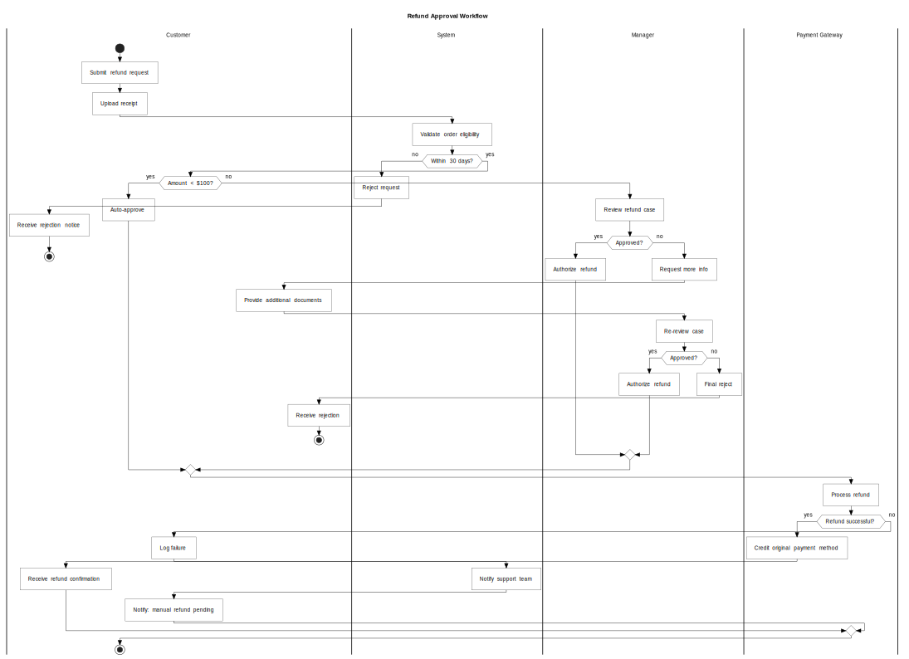
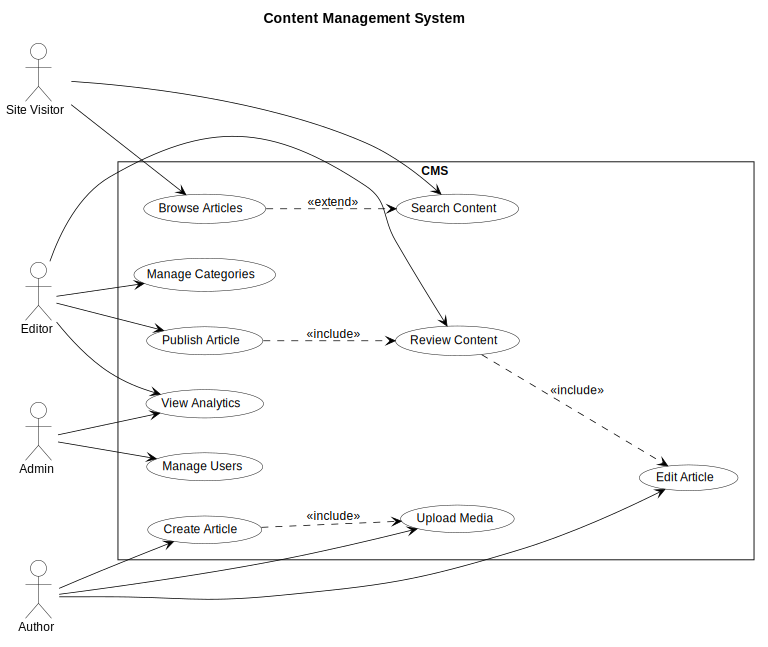
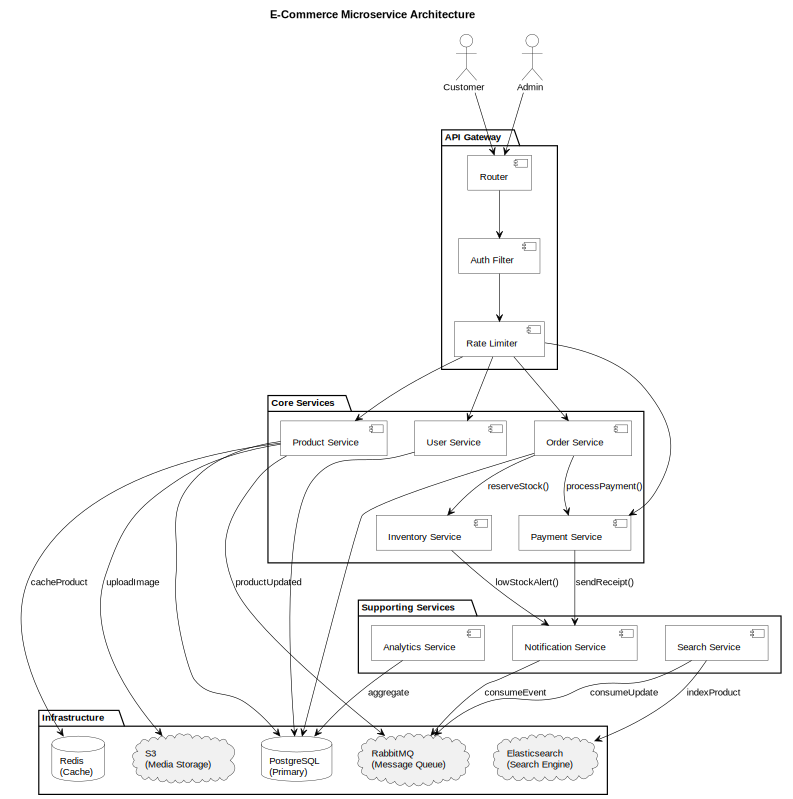
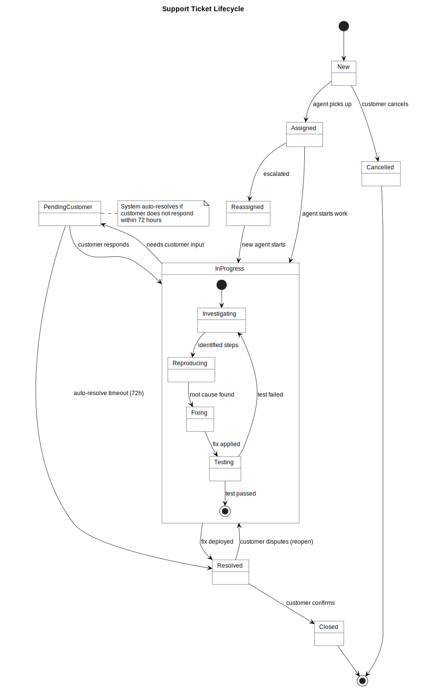
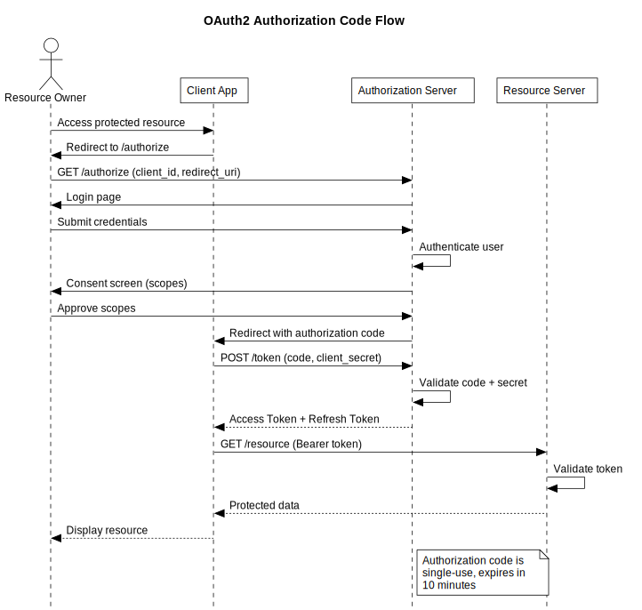

# PlantUML Skill for OpenCode

**English** · [简体中文](README.zh-CN.md)

Natural language → PlantUML diagrams → SVG/PNG/PDF. An [OpenCode](https://github.com/voidzero-dev/opencode) skill that generates [uml-diagrams.org](https://www.uml-diagrams.org)-style (strict OMG UML 2.x, monochrome) diagrams from plain English descriptions.

[](https://clawhub.ai/samonysh/plantuml-skill)
[](https://clawhub.ai/samonysh/plantuml-skill)
[](https://clawhub.ai/samonysh/plantuml-skill)
[](LICENSE)

## Features

- **9 diagram types**: Sequence, Class, Activity, Use Case, Component, State, Deployment, Gantt, Mind Map
- **Natural language input**: Describe what you want — the skill picks the right diagram type
- **uml-diagrams.org reference style**: Pure black-and-white, dashed lifelines, white activation bars, text stereotypes — matches every figure on https://www.uml-diagrams.org
- **Two equivalent preambles**: classic `skinparam` (max backward compatibility) and modern CSS `<style>` block (recommended on PlantUML ≥ 1.2019.9)
- **Cross-platform render scripts**: Bash (Linux/macOS/Git-Bash/WSL) and PowerShell (Windows native)
- **Local-first rendering**: Docker → local JAR → public server (last is **opt-in only**, see [Privacy](#privacy))
- **Text-based stereotypes**: `«interface»` and `«abstract»` instead of circle-with-letter icons
- **Zero color**: Monochrome output suitable for academic papers, RFCs, and technical docs
- **CJK font support**: Chinese/Japanese/Korean character rendering via `--cjk` flag
- **Aspect ratio auto-correction**: Detects and fixes excessively wide or tall diagrams
- **A4 paper fit validation**: Ensures diagrams fit A4 dimensions (794×1123 px @ 96 DPI) with legible font sizes

## Prerequisites

At least one of:

| Method | Requirement |
|---|---|
| Docker (recommended) | `docker pull plantuml/plantuml:latest` |
| Java | JRE 8+ with `plantuml.jar` |
| Internet (opt-in) | Public server backend, off by default — see [Privacy](#privacy) |

Docker is recommended and used by default.

**CJK (Chinese/Japanese/Korean) rendering** requires CJK fonts on the host system when using `--cjk`:
```bash
# Debian/Ubuntu
sudo apt install fonts-wqy-zenhei
# Fedora
sudo dnf install wqy-zenhei-fonts
# Arch
sudo pacman -S wqy-zenhei
```

## Installation

### Via ClawHub (recommended)

```bash
openclaw skills install plantuml-skill
```

### Manual Install

```bash
git clone https://github.com/samonysh/plantuml-skill.git
cp -r plantuml-skill/.opencode/skills/plantuml ~/.config/opencode/skills/
```

Or link it as a project-local skill:

```bash
ln -s $(pwd)/plantuml-skill/.opencode/skills/plantuml .opencode/skills/plantuml
```

## Quick Start

Once the skill is installed, trigger it with natural language in OpenCode:

```
> Draw a sequence diagram showing OAuth2 login flow between User, Client, and Auth Server

> Create a class diagram for an e-commerce order domain model

> Generate an activity diagram for a refund approval workflow with swimlanes
```

The skill will:
1. Parse your requirements and select the appropriate diagram type
2. Generate PlantUML source code with OMG-UML monochrome styling
3. Render it to SVG (PNG and PDF also supported)
4. Display the result inline

### Manual rendering

You can also render `.puml` files directly. The skill ships with both a Bash and a PowerShell entry point, so it works on **Linux, macOS, and Windows**:

**Linux / macOS / Git Bash / WSL:**

```bash
bash .opencode/skills/plantuml/scripts/generate-plantuml.sh input.puml output_dir --format svg
```

**Windows PowerShell:**

```powershell
powershell -ExecutionPolicy Bypass -File .opencode\skills\plantuml\scripts\generate-plantuml.ps1 input.puml output_dir -Format svg
```

Options: `--format svg|png|pdf|txt` (default: `svg`) — PowerShell uses `-Format` instead of `--format`.

| Flag | Description | Default |
|---|---|---|
| `--format svg\|png\|pdf\|txt` | Output format | `svg` |
| `--cjk` | Enable CJK font support | off (auto-detects) |
| `--no-fix` | Disable aspect ratio auto-correction | off (auto-fix enabled) |
| `--no-a4-check` | Disable A4 paper fit validation (794×1123 px portrait at 96 DPI) | off (A4 check ON) |
| `--min-font-pt N` | Minimum legible on-paper font size in pt | `8.0` |
| `--max-aspect N` | Max aspect ratio threshold | `2.5` |

## Supported Diagram Types

| Type | Best for | Example trigger |
|---|---|---|
| **Sequence** | API flows, request/response, handshakes | "A sends X to B, then B responds with Y" |
| **Class** | Domain models, entity relationships | "Customer has many Orders, Order has Items" |
| **Activity** | Workflows, pipelines, approval chains | "If payment valid, ship order; else reject" |
| **Use Case** | System actors, roles, permissions | "Admin can manage users, Editor can publish" |
| **Component** | Microservices, system architecture | "API Gateway routes to User and Order services" |
| **State** | Lifecycles, state machines | "Ticket goes from New → Assigned → Resolved" |
| Deployment | Infrastructure, cloud topology | "App server deployed on AWS with RDS and CDN" |
| Gantt | Timelines, project plans | "Design 2 weeks, dev 4 weeks, test 1 week" |
| Mind Map | Hierarchies, brainstorming | "Break down system architecture into subsystems" |

## Style Standard

All generated diagrams follow the **uml-diagrams.org reference style** — strict OMG UML 2.x
black-and-white rendered with Visio UML 2.x stencils (the same style used on
https://www.uml-diagrams.org):

```
' uml-diagrams.org reference style — strict OMG UML 2.x, monochrome
skinparam style strictuml
skinparam monochrome true
skinparam backgroundColor #FFFFFF
skinparam defaultFontName Helvetica
skinparam shadowing false
skinparam classAttributeIconSize 0
skinparam roundCorner 0
skinparam SequenceLifeLineBorderColor #000000
skinparam SequenceActivationBackgroundColor #FFFFFF
```

Key rules (mapped to uml-diagrams.org figures):
- **No circle stereotype icons** — `«interface»` / `«abstract»` rendered as text, not Ⓒ/Ⓘ/Ⓐ circles
- **Abstract classifiers in italics** — matches UML 2.5 §9 and uml-diagrams.org
- **No color** — only `#000000` and `#FFFFFF`
- **No 3D shadows**
- **No attribute visibility circles** (●/◐/○) — uses `+`/`-`/`#` text markers
- **Dashed lifelines** — per uml-diagrams.org sequence diagram figures
- **White activation bars with black border** — per the execution specification definition
- **Thin uniform hair-line strokes** (≈0.75pt borders/arrows)
- **Standard UML notation** — stick figures, dashed dependencies, dotted lifelines

### Alternative — CSS `<style>` preamble

PlantUML 1.2019.9+ recommends the CSS-like `<style>` block instead of `skinparam`
([plantuml.com/style-evolution](https://plantuml.com/style-evolution)). The skill ships
a **second, visually equivalent preamble** based on `<style>` for users on modern
PlantUML versions. See the `Alternative — CSS-style Preamble` section in
[`SKILL.md`](.opencode/skills/plantuml/SKILL.md) and the reference example
[`examples/07_sequence_oauth2_css_style.puml`](examples/07_sequence_oauth2_css_style.puml).

## Examples

### Sequence Diagram — OAuth2 Authorization Code Flow


### Class Diagram — Order Domain Model


### Activity Diagram — Refund Approval Workflow



### Use Case Diagram — CMS System



### Component Diagram — Microservice Architecture



### State Diagram — Support Ticket Lifecycle



### Sequence Diagram — OAuth2 Flow (CSS-style preamble, alternative)

Same business scenario as example #1, but uses the modern **CSS `<style>` block**
recommended by [plantuml.com/style-evolution](https://plantuml.com/style-evolution)
instead of `skinparam`. Both preambles produce the same uml-diagrams.org look — use the
CSS variant on PlantUML ≥ 1.2019.9 where `skinparam` is being phased out.



All example source files (`.puml`) are in the [`examples/`](examples/) directory. They all use the **uml-diagrams.org reference style** preamble (example #07 uses the alternative CSS variant). You can regenerate any single one:

```bash
bash .opencode/skills/plantuml/scripts/generate-plantuml.sh examples/01_sequence_oauth2.puml examples --format svg
```

Or regenerate all of them at once:

```bash
# Bash
for f in examples/*.puml; do bash .opencode/skills/plantuml/scripts/generate-plantuml.sh "$f" examples --format svg; done
```

```powershell
# PowerShell
Get-ChildItem examples\*.puml | ForEach-Object {
    powershell -ExecutionPolicy Bypass -File .opencode\skills\plantuml\scripts\generate-plantuml.ps1 $_.FullName examples -Format svg
}
```

## Project Structure

```
plantuml-skill/
├── .opencode/
│   └── skills/
│       └── plantuml/
│           ├── SKILL.md                    # Skill definition & instructions
│           ├── scripts/
│           │   ├── generate-plantuml.sh    # Render script — Linux/macOS/Git-Bash/WSL
│           │   └── generate-plantuml.ps1   # Render script — Windows PowerShell
│           └── references/                 # (extensible)
├── examples/
│   ├── 01_sequence_oauth2.puml / .svg
│   ├── 02_class_order_domain.puml / .svg
│   ├── 03_activity_refund.puml / .svg
│   ├── 04_usecase_cms.puml / .svg
│   ├── 05_component_microservices.puml / .svg
│   ├── 06_state_ticket.puml / .svg
│   └── 07_sequence_oauth2_css_style.puml / .svg   # CSS-style preamble (alternative)
├── .gitignore
├── README.md           # English README
└── README.zh-CN.md     # 简体中文 README
```

## Render Script

The skill ships with two equivalent entry points so it runs on every major OS:

- `.opencode/skills/plantuml/scripts/generate-plantuml.sh` — Bash (Linux, macOS, Git Bash, MSYS2, WSL, Cygwin)
- `.opencode/skills/plantuml/scripts/generate-plantuml.ps1` — PowerShell (native Windows)

Both try three backends in **strict priority order — local-first**.
Docker and the local JAR are tried first; the public server is **opt-in
only** because it uploads diagram source to a third party:

1. **Docker** (`plantuml/plantuml:latest`) — preferred default, fully local
2. **Local JAR** (`plantuml.jar`) — offline fallback (requires Java)
3. **PlantUML public server** (`https://www.plantuml.com/plantuml`) —
   **opt-in** via `--use-public-server` (Bash) / `-UsePublicServer`
   (PowerShell). See [Privacy](#privacy) before enabling.

```bash
# SVG (default) — Bash
bash .opencode/skills/plantuml/scripts/generate-plantuml.sh diagram.puml ./output

# PNG — Bash
bash .opencode/skills/plantuml/scripts/generate-plantuml.sh diagram.puml ./output --format png

# SVG with CJK font support
bash .opencode/skills/plantuml/scripts/generate-plantuml.sh diagram.puml ./output --cjk

# PNG, with custom aspect ratio threshold
bash .opencode/skills/plantuml/scripts/generate-plantuml.sh diagram.puml ./output --format png --max-aspect 3.0

# ASCII art — Bash (txt format skips image rendering)
bash .opencode/skills/plantuml/scripts/generate-plantuml.sh diagram.puml ./output --format txt

# Disable aspect ratio auto-correction
bash .opencode/skills/plantuml/scripts/generate-plantuml.sh diagram.puml ./output --no-fix
```

```powershell
# SVG (default) — PowerShell
powershell -ExecutionPolicy Bypass -File .opencode\skills\plantuml\scripts\generate-plantuml.ps1 diagram.puml .\output

# PNG — PowerShell
powershell -ExecutionPolicy Bypass -File .opencode\skills\plantuml\scripts\generate-plantuml.ps1 diagram.puml .\output -Format png
```

### CJK Font Support

When rendering diagrams containing Chinese, Japanese, or Korean characters, the `--cjk` flag:
- Replaces `Helvetica` with `WenQuanYi Micro Hei` in the PlantUML source
- Mounts host font directories into the Docker container
- Refreshes the container's font cache before rendering

Without `--cjk`, CJK characters are auto-detected and a warning is shown.

### Aspect Ratio Auto-Correction

After rendering SVG or PNG output, the script checks the image dimensions. If the aspect ratio
(width/height or height/width) exceeds `--max-aspect` (default 2.5:1), the script:

1. Modifies the `.puml` with layout directives (`left to right direction`, `top to bottom direction`, `scale`, padding adjustments)
2. Re-renders the diagram
3. Checks again (up to 2 correction attempts)

This prevents diagrams from being excessively stretched in either dimension.

## Privacy

This skill is **local-first**: by default, all rendering happens on your own
machine and your `.puml` source code never leaves the host.

The PlantUML public server backend (`plantuml.com`) is **disabled by default**
and only runs when you explicitly opt in:

```bash
# Bash — explicit opt-in (uploads diagram source to plantuml.com)
bash .opencode/skills/plantuml/scripts/generate-plantuml.sh diagram.puml ./output --use-public-server
```

```powershell
# PowerShell — explicit opt-in
powershell -ExecutionPolicy Bypass -File .opencode\skills\plantuml\scripts\generate-plantuml.ps1 diagram.puml .\output -UsePublicServer
```

When opt-in is active, the script prints a runtime privacy warning and POSTs
the entire `.puml` source to `https://www.plantuml.com/plantuml`.

**Do NOT enable `--use-public-server` for diagrams containing**:

- Internal hostnames, service names, or architecture details you don't want public
- Credentials, tokens, API keys, or connection strings (even as placeholders)
- Customer data, PII, or regulated content
- Proprietary design IP, trade secrets, or unreleased product details

If you are unsure, stay with the local default. Installing Docker
(`docker pull plantuml/plantuml:latest`) or `plantuml.jar` removes any need
for the remote backend.

### CJK Docker mounts

When `--cjk` is combined with the Docker backend, the script mounts host
font directories **read-only** so PlantUML can find CJK fonts. The mounts
are scoped to font directories only and are used solely inside the
throwaway PlantUML container — no host data is written.

## License

MIT-0
