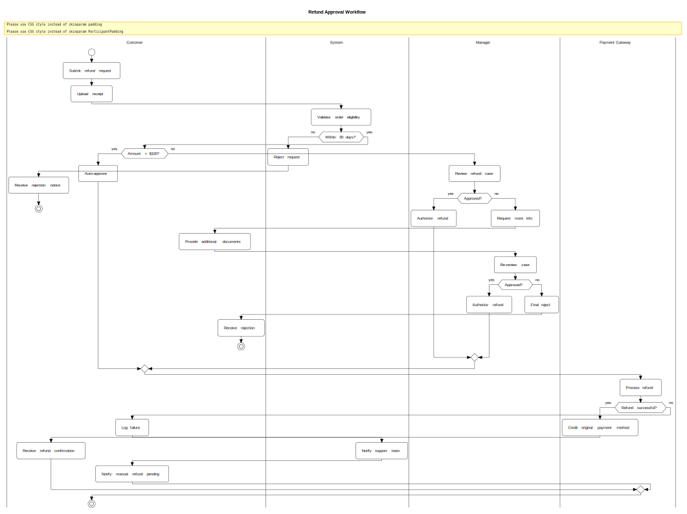
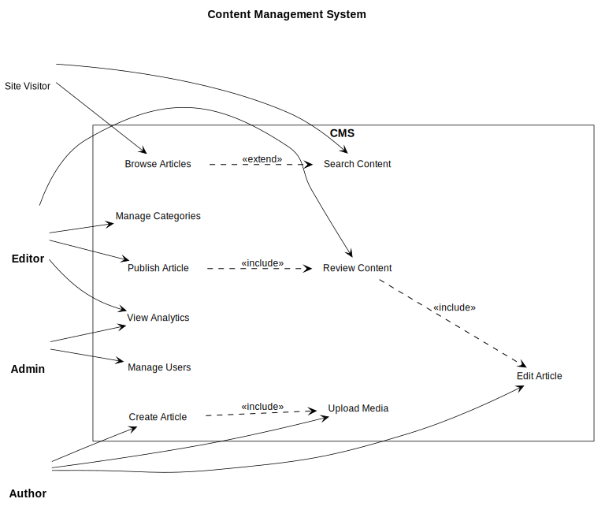
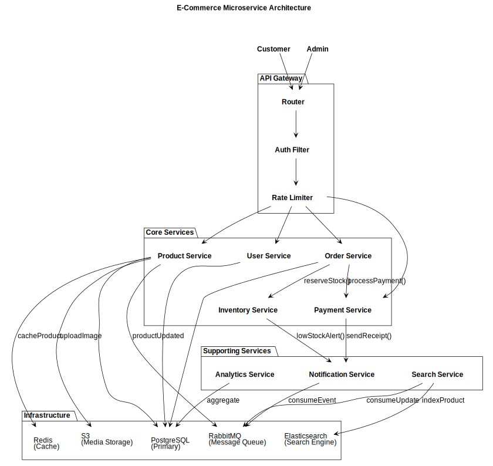
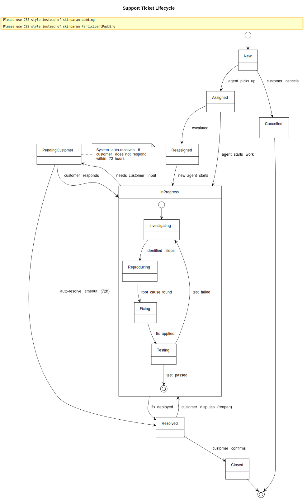

# PlantUML Skill for OpenCode

[English](README.md) · **简体中文**

自然语言 → PlantUML 图表 → SVG/PNG/PDF。这是一个 [OpenCode](https://github.com/voidzero-dev/opencode) skill，可以根据中英文自然语言描述生成 [uml-diagrams.org](https://www.uml-diagrams.org) 同款风格（严格遵循 OMG UML 2.x，黑白单色）的 UML 图表。

[](https://skills.sh/samonysh/plantuml-skill)
[](https://clawhub.ai/samonysh/plantuml-skill)
[](https://clawhub.ai/samonysh/plantuml-skill)
[](https://clawhub.ai/samonysh/plantuml-skill)
[](LICENSE)

## 特性

- **9 种图表类型**：时序图（Sequence）、类图（Class）、活动图（Activity）、用例图（Use Case）、组件图（Component）、状态图（State）、部署图（Deployment）、甘特图（Gantt）、思维导图（Mind Map）
- **自然语言驱动**：你只需描述需求 —— skill 会自动挑选合适的图表类型
- **uml-diagrams.org 参考风格**：纯黑白、虚线生命线、白色激活条、文本 stereotype —— 与 https://www.uml-diagrams.org 上的每一张图视觉一致
- **两套等价 preamble**：经典 `skinparam`（向后兼容性最强）与现代 CSS `<style>` 块（推荐用于 PlantUML ≥ 1.2019.9）
- **跨平台渲染脚本**：Bash（Linux/macOS/Git-Bash/WSL）与 PowerShell（Windows 原生）双入口
- **本地优先渲染**：Docker → 本地 JAR → 公网服务器（公网为**显式启用**，详见 [隐私](#隐私说明)）
- **文本 stereotype**：使用 `«interface»` / `«abstract»` 文本，不用带字母的彩色圆圈图标
- **零配色**：纯黑白输出，适合学术论文、RFC、技术文档等场景
- **CJK 字体支持**：通过 `--cjk` 标志支持中文、日文、韩文字符渲染
- **宽高比自动修正**：检测并自动修复过宽或过高的图表（默认目标宽高比 0.7–1.4）
- **A4 纸张适配**：确保图表适配 A4 纸张尺寸（96 DPI 下 794×1123 px），保证打印时字体可读
- **暗色模式**：通过 `--dark-mode` 标志同时输出亮色和暗色两个版本（`.dark.svg` / `.dark.png`）

## 环境要求

至少满足以下一项：

| 渲染方式 | 依赖 |
|---|---|
| Docker（推荐） | `docker pull plantuml/plantuml:latest` |
| Java | JRE 8+ 与 `plantuml.jar` |
| 互联网（需显式启用） | Kroki 公网服务器（kroki.io）后端，默认关闭，详见 [隐私](#隐私说明) |

推荐使用 Docker —— 这是默认且首选的方案，完全在本地渲染，不会上传任何内容。

**CJK（中日韩）字符渲染**需要宿主机安装 CJK 字体（使用 `--cjk` 参数时）：
```bash
# Debian/Ubuntu
sudo apt install fonts-wqy-zenhei
# Fedora
sudo dnf install wqy-zenhei-fonts
# Arch
sudo pacman -S wqy-zenhei
```

## 安装

### 通过 skills.sh 安装（跨 agent，推荐）

```bash
npx skills add samonysh/plantuml-skill
```

### 通过 ClawHub 安装

```bash
openclaw skills install plantuml-skill
```

### 手动安装

```bash
git clone https://github.com/samonysh/plantuml-skill.git
cp -r plantuml-skill/skills/plantuml ~/.config/opencode/skills/
```

或者作为项目内 skill 链接进来：

```bash
ln -s $(pwd)/plantuml-skill/skills/plantuml .opencode/skills/plantuml
```

## 快速上手

安装好之后，在 OpenCode 里直接用自然语言触发：

```
> 画一张 OAuth2 登录流程时序图，参与方包括用户、客户端和授权服务器
> 帮我生成一张电商订单领域模型的类图
> 绘制一个带泳道的退款审批流程活动图
```

skill 会自动：
1. 解析你的需求，挑选最合适的图表类型
2. 生成带 uml-diagrams.org 风格 preamble 的 PlantUML 源码
3. 渲染为 SVG（同时支持 PNG / PDF）
4. 把结果内联展示给你

### 手动渲染

你也可以直接渲染 `.puml` 源文件。skill 同时提供 Bash 和 PowerShell 两个入口脚本，**可在 Linux、macOS、Windows 上原生运行**：

**Linux / macOS / Git Bash / WSL：**

```bash
bash skills/plantuml/scripts/generate-plantuml.sh input.puml output_dir --format svg
```

**Windows PowerShell：**

```powershell
powershell -ExecutionPolicy Bypass -File skills\plantuml\scripts\generate-plantuml.ps1 input.puml output_dir -Format svg
```

参数：`--format svg|png|pdf|txt`（默认 `svg`）— PowerShell 版本用 `-Format`，效果完全等价。

| 参数 | 说明 | 默认值 |
|---|---|---|
| `--format svg\|png\|pdf\|txt` | 输出格式 | `svg` |
| `--cjk` | 启用 CJK 字体支持 | 关闭（自动检测） |
| `--no-fix` | 禁用宽高比自动修正 | 关闭（自动修正） |
| `--no-a4-check` | 禁用 A4 纸张适配检查（96 DPI 下人像 794×1123 px） | 关闭（默认开启检查） |
| `--min-font-pt N` | A4 纸上最小可读字号（pt） | `8.0` |
| `--min-aspect N` | 宽高比下限（过高图表自动修正） | `0.7` |
| `--max-aspect N` | 宽高比上限（过宽图表自动修正） | `1.4` |
| `--dark-mode` | 同时输出亮色 + 暗色版本（`.dark.svg`/`.dark.png`）；需显式启用 | 关闭 |

## 支持的图表类型

| 类型 | 适用场景 | 触发示例 |
|---|---|---|
| **时序图（Sequence）** | API 调用、请求响应、握手协议 | "A 给 B 发 X，然后 B 回 Y" |
| **类图（Class）** | 领域模型、实体关系 | "Customer 有多个 Order，Order 包含多个 Item" |
| **活动图（Activity）** | 工作流、流水线、审批链 | "如果支付成功就发货，否则拒绝" |
| **用例图（Use Case）** | 系统角色、权限职责 | "管理员能管用户，编辑能发文" |
| **组件图（Component）** | 微服务、系统架构 | "API Gateway 把请求路由到用户服务和订单服务" |
| **状态图（State）** | 生命周期、状态机 | "工单从 New → Assigned → Resolved" |
| 部署图（Deployment） | 基础设施、云拓扑 | "应用部署在 AWS，使用 RDS 和 CDN" |
| 甘特图（Gantt） | 时间线、项目计划 | "设计 2 周，开发 4 周，测试 1 周" |
| 思维导图（Mind Map） | 层级结构、头脑风暴 | "把系统架构分解为子系统" |

## 风格规约

所有生成的图表都遵循 **uml-diagrams.org 参考风格** —— 严格遵循 OMG UML 2.x、用 Visio UML 2.x stencils 渲染的黑白外观（与 https://www.uml-diagrams.org 上的图视觉一致）：

自 PlantUML 1.2019.9 起，官方推荐使用 CSS 风格的 `<style>` 块替代 `skinparam`（参见 [plantuml.com/style-evolution](https://plantuml.com/style-evolution)）。本 skill **默认使用 CSS `<style>` 前言块**，仅保留两个无 CSS 等价物的 `skinparam` 设置。

```css
<style>
root {
  FontName Helvetica
  FontSize 12
  FontColor #000000
  BackGroundColor #FFFFFF
  LineColor #000000
  LineThickness 0.75
  RoundCorner 0
  Shadowing 0
}
/* ... 各图表类型作用域样式 ... */
</style>
skinparam style strictuml           ' 无 CSS 等价物
skinparam classAttributeIconSize 0  ' 无 CSS 等价物
```

关键规则（对应到 uml-diagrams.org 的具体图示）：
- **不使用 stereotype 圆圈图标** —— `«interface»` / `«abstract»` 以文本形式呈现，而不是 Ⓒ/Ⓘ/Ⓐ 圆圈
- **抽象类名用斜体** —— 与 UML 2.5 §9 及 uml-diagrams.org 一致
- **无任何颜色** —— 只有 `#000000` 与 `#FFFFFF`
- **无 3D 阴影**
- **无属性可见性圆点**（●/◐/○）—— 使用 `+`/`-`/`#`/`~` 文本标记
- **虚线生命线** —— 与 uml-diagrams.org 时序图样式一致
- **白色填充 + 黑色细边的激活条** —— 与 execution specification 的官方定义一致
- **统一细发丝线条**（约 0.75pt 的边框与箭头）
- **标准 UML 几何形状** —— 棒人 actor、虚线依赖、虚线生命线

### 备选方案 —— `skinparam` preamble（向后兼容）

如需兼容 PlantUML < 1.2019.9 的旧版本，可使用经典 `skinparam` 前言块。两套 preamble 视觉完全一致。详见 [`SKILL.md`](skills/plantuml/SKILL.md) 中的 "Backup — `skinparam` Preamble" 章节。

## 示例

所有示例均使用 **CSS `<style>` 前言块**（推荐）。`skinparam` 版本同样保留，供向后兼容使用。

### 时序图 —— OAuth2 授权码模式


### 类图 —— 订单领域模型


### 活动图 —— 退款审批流程



### 用例图 —— CMS 内容管理系统



### 组件图 —— 电商微服务架构



### 状态图 —— 工单生命周期



### 时序图 —— OAuth2 流程（skinparam 前言，向后兼容）

与示例 #1 业务相同，但使用经典 `skinparam` 前言块。两套 preamble 视觉完全一致 —— 在 PlantUML ≥ 1.2019.9 上，建议优先采用 CSS 变体。


所有示例源文件都在 [`examples/`](examples/) 目录下。CSS 版本使用推荐的 `<style>` 块；`skinparam` 版本供向后兼容使用。可以单独重新渲染某一个：

```bash
bash skills/plantuml/scripts/generate-plantuml.sh examples/01_sequence_oauth2.puml examples --format svg
```

也可以一次性重渲全部示例：

```bash
# Bash
for f in examples/*.puml; do bash skills/plantuml/scripts/generate-plantuml.sh "$f" examples --format svg; done
```

```powershell
# PowerShell
Get-ChildItem examples\*.puml | ForEach-Object {
    powershell -ExecutionPolicy Bypass -File skills\plantuml\scripts\generate-plantuml.ps1 $_.FullName examples -Format svg
}
```

## 项目结构

```
plantuml-skill/
├── skills/
│   └── plantuml/                       # 规范 skill（skills.sh 发现路径）
│       ├── SKILL.md                    # Skill 定义与详细说明
│       └── scripts/
│           ├── generate-plantuml.sh    # 渲染脚本 — Linux/macOS/Git-Bash/WSL
│           └── generate-plantuml.ps1   # 渲染脚本 — Windows PowerShell
├── .opencode/
│   └── skills/
│       └── plantuml -> ../../skills/plantuml   # 向后兼容符号链接
├── examples/
│   ├── 01_sequence_oauth2.puml / .svg          # skinparam 前言（向后兼容）
│   ├── 01_sequence_oauth2_css.puml / .svg      # CSS 前言（推荐）
│   ├── 02_class_order_domain.puml / .svg
│   ├── 02_class_order_domain_css.puml / .svg
│   ├── 03_activity_refund.puml / .svg
│   ├── 03_activity_refund_css.puml / .svg
│   ├── 04_usecase_cms.puml / .svg
│   ├── 04_usecase_cms_css.puml / .svg
│   ├── 05_component_microservices.puml / .svg
│   ├── 05_component_microservices_css.puml / .svg
│   ├── 06_state_ticket.puml / .svg
│   ├── 06_state_ticket_css.puml / .svg
│   └── 07_sequence_oauth2_css_style.puml / .svg   # 旧版 CSS 示例
├── .gitignore
├── README.md           # 英文 README
└── README.zh-CN.md     # 中文 README（本文件）
```

## 渲染脚本

skill 内置两套等价入口，覆盖所有主流操作系统：

- `skills/plantuml/scripts/generate-plantuml.sh` — Bash（Linux、macOS、Git Bash、MSYS2、WSL、Cygwin）
- `skills/plantuml/scripts/generate-plantuml.ps1` — PowerShell（Windows 原生）

两者都按 **严格优先级顺序 —— 本地优先** 尝试三种后端。Docker 与本地 JAR 优先尝试；
公网服务器仅在用户**显式启用**时才使用，因为它会把图源上传至第三方（默认 kroki.io）：

1. **Docker**（`plantuml/plantuml:latest`）—— 默认首选，完全本地渲染
2. **本地 JAR**（`plantuml.jar`）—— 离线回退（需 Java）
3. **Kroki 公网服务器**（默认 `https://kroki.io`）—— **需显式启用**：
   Bash 加 `--use-public-server`，PowerShell 加 `-UsePublicServer`。可通过
   `PLANTUML_PUBLIC_SERVER=<url>` 覆盖至自托管 Kroki 实例。启用前请阅读
   [隐私说明](#隐私说明)。

```bash
# SVG（默认）— Bash
bash skills/plantuml/scripts/generate-plantuml.sh diagram.puml ./output

# SVG + CJK 字体支持
bash skills/plantuml/scripts/generate-plantuml.sh diagram.puml ./output --cjk

# PNG + 自定义宽高比阈值
bash skills/plantuml/scripts/generate-plantuml.sh diagram.puml ./output --format png --max-aspect 3.0

# ASCII 文本图 — Bash（txt 格式跳过图片渲染）
bash skills/plantuml/scripts/generate-plantuml.sh diagram.puml ./output --format txt

# 禁用宽高比自动修正
bash skills/plantuml/scripts/generate-plantuml.sh diagram.puml ./output --no-fix
```

```powershell
# SVG（默认）— PowerShell
powershell -ExecutionPolicy Bypass -File skills\plantuml\scripts\generate-plantuml.ps1 diagram.puml .\output

# PNG — PowerShell
powershell -ExecutionPolicy Bypass -File skills\plantuml\scripts\generate-plantuml.ps1 diagram.puml .\output -Format png
```

### CJK 字体支持

渲染包含中文、日文或韩文字符的图表时，`--cjk` 参数会：
- 将 `Helvetica` 替换为 `WenQuanYi Micro Hei`（一种 CJK 兼容字体）
- 将宿主机字体目录挂载到 Docker 容器中
- 刷新容器的字体缓存后再进行渲染

未使用 `--cjk` 时，脚本会自动检测 CJK 字符并显示警告。

### 宽高比自动修正

渲染 SVG 或 PNG 输出后，脚本会检查图像尺寸。若宽高比（宽度/高度）超出目标范围（默认 0.7–1.4），脚本会：

1. 对 `.puml` 文件应用布局修正指令（方向切换、间距调整）
2. 重新渲染图表
3. 再次检查（最多进行 2 次修正尝试）

使用 `--min-aspect` 和 `--max-aspect` 可自定义目标范围。修正过程中会保留文本间距，避免文字拥挤。

## 隐私说明

本 skill **本地优先**：默认情况下所有渲染都在你自己的机器上完成，`.puml` 源代码
不会离开宿主机。

Kroki 公网服务器后端（默认 `kroki.io`）**默认关闭**，仅在你显式启用时才会调用：

```bash
# Bash —— 显式启用（会把图源上传至 kroki.io）
bash skills/plantuml/scripts/generate-plantuml.sh diagram.puml ./output --use-public-server
```

```powershell
# PowerShell —— 显式启用
powershell -ExecutionPolicy Bypass -File skills\plantuml\scripts\generate-plantuml.ps1 diagram.puml .\output -UsePublicServer
```

启用后，脚本会先打印一条运行时隐私警告（包含目的地 URL 与运营方信息），然后把
整个 `.puml` 内容 POST 到 `https://kroki.io/plantuml/<format>`（或你的覆盖主机
——见下）。

### 自托管 Kroki

[Kroki](https://github.com/yuzutech/kroki) 是开源项目，可以用 Docker 一键自托管。
要把启用后的流量切到自己的实例（而不是公网 `kroki.io`），设置环境变量
`PLANTUML_PUBLIC_SERVER` 即可：

```bash
# Bash
PLANTUML_PUBLIC_SERVER=https://kroki.internal.example.com \
  bash skills/plantuml/scripts/generate-plantuml.sh diagram.puml ./output --use-public-server
```

```powershell
# PowerShell
$env:PLANTUML_PUBLIC_SERVER = 'https://kroki.internal.example.com'
powershell -ExecutionPolicy Bypass -File skills\plantuml\scripts\generate-plantuml.ps1 diagram.puml .\output -UsePublicServer
```

运行时隐私警告会显示解析后的目标主机，便于上传前确认流向。自定义主机需要暴露
标准的 Kroki 端点形式：`<base>/plantuml/<format>`。

### 为什么是 Kroki（v1.6.0）

早期版本的脚本使用 `https://www.plantuml.com/plantuml`。该端点目前位于
Cloudflare + Ezoic 同意墙之后（POST 会被 302 重定向到一个纯 JavaScript 渲染的
HTML 同意页），导致一切非浏览器自动化都无法用。Kroki 是一个无感替换：

- 服务端运行的就是上游 PlantUML JAR，输出的 SVG/PNG/PDF/TXT 与原后端同源。
- 开源、可自托管，让"把图发出去渲染但留在自己信任边界内"的选项重新可用。
- 公网 `kroki.io` 实例由 Yuzu Tech（EU）运营，相比此前 US CDN 前置的
  plantuml.com 更接近 GDPR 等基线默认。

**以下情况下请勿启用 `--use-public-server`**：

- 内部主机名 / 服务名 / 架构细节（不希望对外披露）
- 凭据、令牌、API Key、连接串（即使是占位符也不要）
- 客户数据、个人信息或受监管内容
- 专有设计 IP、商业秘密、未发布的产品信息

如果不确定，请保持默认（本地渲染）。安装 Docker
（一条命令：`docker pull plantuml/plantuml:latest`）或下载 `plantuml.jar`
就完全不需要公网后端。

### CJK Docker 字体挂载

启用 `--cjk` 与 Docker 后端一起使用时，脚本会以**只读**方式将宿主字体目录挂载
到容器中，让 PlantUML 能找到系统已安装的 CJK 字体。挂载范围严格限定在字体目录，
仅作用于一次性 PlantUML 容器内部，不会向宿主写入任何数据。

## License

MIT-0
